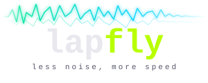
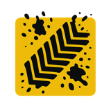
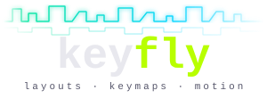

# AndamanWorks

Independent software studio building tools for people who move: telemetry
analysis for riders, trail forecasts for mountain bikers, note-polish for
Obsidian, and typing software for custom keyboards.

## Products

<table>
<tr>
<td width="140" align="center" valign="middle">
  
</td>
<td valign="middle">
  <strong><a href="https://lapfly.com">Lapfly</a></strong> 
  Plain-English lap debriefs from raw motorsport telemetry. Drop in a MoTeC, AiM, RaceChrono or GPS file and get braking markers, trail-braking depth, shift advice, delta-time and public leaderboards. Built for riders, coaches and race teams.
</td>
</tr>
<tr>
<td width="140" align="center" valign="middle">
  
</td>
<td valign="middle">
  <strong><a href="https://mudwatch.com">MudWatch</a></strong> 
  Trail-condition forecasts for mountain bikers. Goes beyond "is it raining?" to model accumulated rainfall, surface type, grade and drainage, so you pick the right trail for the day. Strava integration annotates rides with conditions.
</td>
</tr>
<tr>
<td width="140" align="center" valign="middle">
  
</td>
<td valign="middle">
  <strong><a href="https://andamanworks.com/#products">Burnish Pro</a></strong> 
  The paid edition of our diff-first Obsidian plugin: tidy, restructure, distil and merge notes behind a per-hunk diff you accept or reject before anything is written. Nothing writes to your vault silently. Free core in the official directory.
</td>
</tr>
<tr>
<td width="140" align="center" valign="middle">
  
</td>
<td valign="middle">
  <strong><a href="https://andamanworks.com/keyfly">Keyfly</a></strong> 
  Free typing app for modified layouts and hand-rolled keymaps: practice what your firmware actually types, right in your browser.
</td>
</tr>
</table>

## Labs

Free and open source. Lower stakes, same craft.

- [**keymap-ai**](https://github.com/johncattrall/keymap-ai) · turns coding agents into ZMK/QMK firmware experts ([install via skills.sh](https://www.skills.sh/johncattrall/keymap-ai/keymap-ai))
- [**Burnish**](https://github.com/johncattrall/burnish) · open-source core of the Obsidian plugin ([directory listing](https://community.obsidian.md/plugins/burnish))
- **Detour** · craft beer meets coffee in one search; coming to the Garmin Connect IQ store
- **River Ping flood monitor** · early-warning flood telemetry for Chiang Mai, a public-good project

Graduation rule: a lab project crosses to Products when it heads to market.

## Contact

hello@andamanworks.com · [andamanworks.com](https://andamanworks.com)
